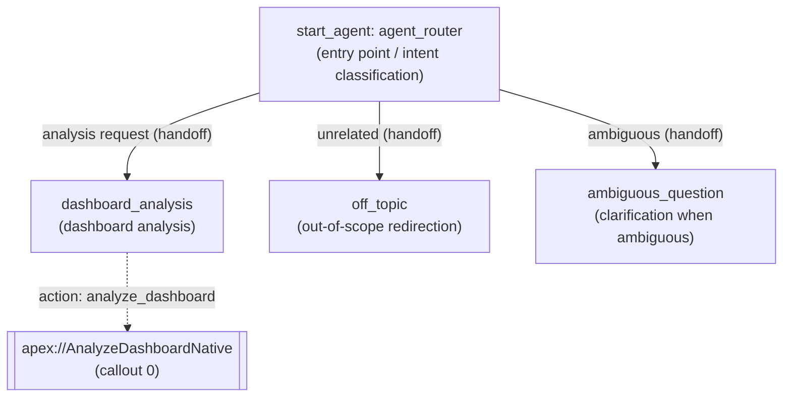

# Agent Spec — Dashboard Analyst

> An **internal (Employee)** agent built with the new builder (Agent Script / AiAuthoringBundle).
> It reads the Lightning dashboard currently displayed to the user via **native Apex (Reports API, no callout required)** and summarizes and analyzes it in English.

## 1. Purpose & Scope
- **Purpose**: When a user asks it to "analyze" the dashboard they're viewing, the agent returns the overall trends, Key KPIs, notable patterns, and recommended actions in English.
- **In scope**: Summarizing the contents of any Lightning dashboard, extracting KPIs, analyzing trends, and answering follow-up questions.
- **Out of scope**: Editing/creating dashboards, CRM Analytics (Lens), cross-org analysis.

## 2. Configuration
- **Agent type**: `AgentforceEmployeeAgent` (internal use)
- **default_agent_user**: N/A — not set, since this is an Employee Agent (setting it causes publish/preview to fail)
- **default_locale**: `ja`
- **Permissions**: PermissionSet `Analytics_Dashboard_Agent` (grants access to Apex `AnalyzeDashboardNative`)
- **Bundle**: `force-app/main/default/aiAuthoringBundles/Dashboard_Analyst/`
- **Status**: Published to org `<YOUR_ORG_ID>` — **v1 Active**

## 3. Subagent Map

All transitions are **handoffs** (`@utils.transition to`). There is no delegation/escalation (escalation is not possible for an Employee Agent).

## 4. Actions & Backing Logic

### `analyze_dashboard`
- **Backing**: Apex `AnalyzeDashboardNative` (invocable, `with sharing`) — **IMPLEMENTED & DEPLOYED**
- **Target**: `apex://AnalyzeDashboardNative`
- **Approach**: Queries `Dashboard` / `DashboardComponent` via SOQL → runs each report with `Reports.ReportManager.runReport(reportId, false)` → extracts the Total and groupings from the factMap and formats them as markdown. **0 HTTP callouts / no Named Credential required** (verified on the org: `Number of callouts: 0`).
- **Inputs**:
  | Name | Type | Required | Description |
  |---|---|---|---|
  | `dashboardIdOrUrl` | string | Yes | Dashboard Id (01Z…) or Lightning URL. Slot-filled by the LLM from the conversation/screen context. |
- **Outputs** (all `filter_from_agent: False` = shown to the user):
  | Name | Type | Description |
  |---|---|---|
  | `summary` | string | Markdown summary of each report's Total and breakdown |
  | `dashboardId` | string | Resolved 18-character Id |
  | `dashboardName` | string | Dashboard name |
  | `componentCount` | number | Number of components |

## 5. Variables
| Name | Type | Default | Purpose / Gate |
|---|---|---|---|
| `dashboard_id` | mutable string | `""` | The most recently resolved dashboard Id. Updated via `set @outputs.dashboardId`. |
| `last_summary` | mutable string | `""` | The most recent summary. If not empty, it is reused for follow-up questions instead of re-fetching (loop prevention). |

## 6. Gating Logic
- **Action loop prevention**: At the start of the `dashboard_analysis` instructions, `if @variables.last_summary != "":` is evaluated, explicitly telling the LLM not to re-run the action if a summary already exists. Friction is further added via `with dashboardIdOrUrl = ...` (slot-fill).
- **Grounding safety**: The output field names (dashboardName/componentCount/summary) are explicitly stated in the instructions, use of the `show_command` tool is prohibited, and rounding or paraphrasing of numeric values is prohibited.
- **Screen context (verified)**: `source: @context.currentRecordId` is rejected by `sf agent validate` as a compile error on this org / API 67.0. In addition, that token only resolves when the Employee Agent is embedded in a LEX "record page," and is not guaranteed on a Dashboard page (which is not a record page). Therefore, linked variables are not used; instead, the **URL/ID is slot-filled from the conversation**. If no URL/Id is provided, the agent does not guess and instead specifically asks the user to paste the URL (verified live in v2).

## 7. Verification Results (authoring-bundle live preview, `--use-live-actions`)
| Case | Input | Result |
|---|---|---|
| Initial analysis | "Analyze this dashboard" + URL | router → dashboard_analysis, `analyze_dashboard` executed **once**, read the Enablement Dashboard (12 components), and responded in English with ■ Overview / ■ Key KPIs / ■ Trends & Notable Patterns / ■ Recommended Actions. trace: TransitionStep×1, FunctionStep×1, Guardrails=pass |
| Follow-up | "Which component has the highest count?" | Answered based on `last_summary` without re-running the action |
| No URL | "Analyze this dashboard" | Did not guess, and politely asked the user to paste the URL |
